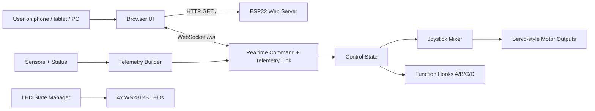
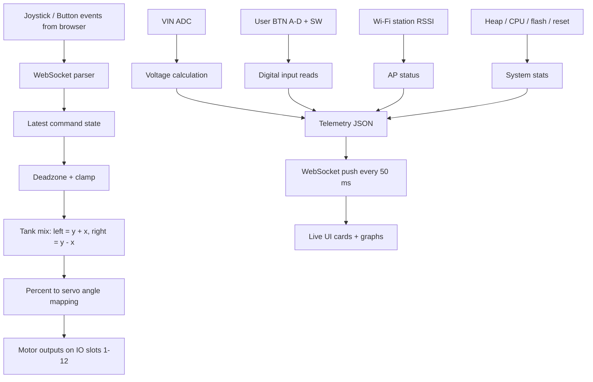

# LoR Core V3 Web Interface Robot Control

## Overview

`LoR_v3_Web_buttons` turns a LoR Core V3 into a self-hosted robot controller with a browser UI.

The ESP32:

- Creates its own Wi-Fi access point
- Serves the control page from onboard flash
- Maintains a low-latency WebSocket link to the browser
- Mixes joystick X/Y into left and right drive outputs
- Streams live telemetry back to the UI
- Stops the robot automatically if commands stop arriving

This makes the project useful for demos, minibots, and test rigs where you want phone or laptop control without installing a native app or relying on external network infrastructure.

## System Overview

### What the system does

At power-up, the LoR Core V3 boots as a standalone Wi-Fi access point with the fixed IP address `10.0.0.1`. A user connects directly to that network, opens the hosted web page, and drives the robot from the joystick and A/B/C/D function buttons. The page keeps a WebSocket connection open for real-time input and telemetry.

The control path is designed so the robot fails safe:

- If no browser is connected, motor output is stopped
- If joystick commands go stale for more than `150 ms`, motor output is stopped
- If the joystick returns to center, motor output is stopped

### High-level architecture



### Firmware data flow



## UI Screenshots

### Desktop / main operator view

<p align="center">
  
</p>

### Mobile views

<p align="center">
  &nbsp;&nbsp;&nbsp;&nbsp;
  
</p>

### Project / platform view

<p align="center">
  
</p>

## User Control Interface Guide

### Top status area

- `WS` pill: Shows whether the browser is actively connected to the ESP32 WebSocket.
- `IP` pill: Reminds the operator that the interface is hosted at `10.0.0.1`.
- `Theme` toggle: Switches between light and dark UI themes.

### Telemetry cards

- `BATTERY`: Calculated battery voltage, status badge, and a short history graph.
- `VIN RAW`: Raw ADC reading used to derive the displayed battery voltage.
- `RSSI`: Wi-Fi signal strength for the connected station.
- `LAG`: Client-side estimate of message cadence / link responsiveness.
- `CMD AGE`: Time since the latest joystick or function command was received by the ESP32.
- `HEAP`: Current free heap and minimum observed heap, plus a trend graph.
- `INPUTS`: Live state of physical input lines `A`, `B`, `C`, `D`, and `SW`.
- `UPTIME`: Firmware runtime since boot.
- `STATIONS`: Number of devices currently associated with the AP.
- `SYSTEM`: Quick summary of CPU MHz, flash size, and reset reason.

### Drive controls

- Center joystick: Main XY drive input.
- `A`, `B`, `C`, `D` corner buttons: Momentary function triggers sent immediately over WebSocket.

### Driving behavior

- Drag the joystick away from center to command motion.
- Release the joystick to send zero and stop the drive.
- If the browser tab disconnects or command packets stop, the firmware stops the motors automatically.
- The joystick is normalized to `-1.0 .. 1.0` on each axis before mixing.

### Button behavior

The four on-screen buttons call these firmware hooks:

- `A` -> `functionA()`
- `B` -> `functionB()`
- `C` -> `functionC()`
- `D` -> `functionD()`

These hooks are currently empty, which is intentional: they are clean extension points for custom robot actions such as lights, grippers, sounds, firing mechanisms, mode changes, or preset servo moves.

## Repository Contents

- `LoR_v3_Web_buttons.ino`: Main firmware, Wi-Fi AP setup, control logic, telemetry, LEDs, and motor output handling.
- `index_html.h`: Embedded HTML/CSS/JavaScript UI served directly by the ESP32.
- `README.md`: Project documentation.

## Setup

### Required libraries

Install these in Arduino IDE before compiling:

- `Async TCP` version `3.4.10` by ESP32Async
- `ESP Async Webserver` version `3.10.3` by ESP32Async
- `ESP32Servo` version `3.0.7` by Kevin Harrington and John K. Bennett
- `FastLED` version `3.10.3` by Daniel Garcia

### ESP32 board package

In Arduino IDE:

1. Open `File -> Preferences`
2. Add this URL to `Additional Boards Manager URLs`

```text
https://dl.espressif.com/dl/package_esp32_index.json
```

3. Open `Tools -> Board -> Boards Manager`
4. Install `esp32` by Espressif Systems

### Board selection

Use:

- `Tools -> Board -> ESP32 Arduino -> ESP32 Dev Module`

## Quick Start

### 1. Keep both files together

Make sure `LoR_v3_Web_buttons.ino` and `index_html.h` are in the same Arduino sketch folder before opening the project.

### 2. Set the robot Wi-Fi name and password

Edit these constants in `LoR_v3_Web_buttons.ino`:

```cpp
static const char *AP_SSID = "Minibot v3 Web Interface";
static const char *AP_PASS = "password";
```

### 3. Upload the firmware

- Select `ESP32 Dev Module`
- Select the correct COM port
- Compile and upload

### 4. Connect to the robot

- Open Wi-Fi settings on your phone, tablet, or PC
- Connect to the robot access point

### 5. Open the control page

Browse to:

```text
http://10.0.0.1
```

### 6. Confirm the link is live

The `WS` indicator should change to connected. Once connected, the UI starts receiving telemetry and the joystick can command drive output.

## Firmware Architecture Breakdown

### 1. Network and web serving

The ESP32 runs in `WIFI_AP` mode and uses a fixed network configuration:

- IP: `10.0.0.1`
- Gateway: `10.0.0.1`
- Subnet: `255.255.255.0`

The firmware exposes:

- `/` -> the embedded control page from `INDEX_HTML`
- `/ws` -> the WebSocket endpoint used for command and telemetry traffic
- `/health` -> plain-text `ok` health endpoint

### 2. Real-time control path

The browser sends joystick frames shaped like:

```json
{"type":"joy","x":0.25,"y":0.80}
```

The firmware:

1. Parses `x` and `y`
2. Clamps them to `-1.0 .. 1.0`
3. Applies a `0.06` deadzone
4. Mixes them into left and right drive values
5. Scales to a max drive command of `90%`
6. Converts percentage into servo-style angles
7. Writes to left and right motor groups

### 3. Motor output model

The sketch uses `ESP32Servo` objects for `MotorOutput[13]` and groups outputs as:

- Left side: slots `7..12`
- Right side: slots `1..6`

Key points:

- `Motor_STOP()` writes `90` degrees to all active motor slots
- `pctToServoAngle_()` maps `-100..100` to `0..180`
- `DriveFromJoystick()` normalizes mixed output to preserve proportional steering

This structure is suitable for continuous-rotation servo style controllers, ESC-like devices that accept servo pulses, and other pulse-width-driven actuators.

### 4. Telemetry engine

Telemetry is broadcast to all connected WebSocket clients every `50 ms` and includes:

- `vin`
- `vin_raw`
- `rssi_dbm`
- `btnA`, `btnB`, `btnC`, `btnD`, `sw`
- `uptime_ms`
- `cmd_age_ms`
- `stations`
- `heap_free`
- `heap_min`
- `cpu_mhz`
- `flash_mb`
- `reset`

This gives the operator both robot health data and communication quality feedback in one screen.

### 5. LED state manager

The four WS2812B LEDs communicate controller state:

| State | Meaning | Color / Pattern |
|---|---|---|
| `LEDM_BOOT` | Boot / startup | Solid blue |
| `LEDM_DISCONNECTED` | No WebSocket client connected | Alternating blue / white |
| `LEDM_IDLE` | Connected but stopped | Solid red |
| `LEDM_COMMAND` | Joystick command active | Solid green |
| `LEDM_FUNCTION` | A/B/C/D button event received | Solid cyan for 200 ms |

### 6. Safety behavior

The sketch includes several practical safeguards:

- Stops output if there are no WebSocket clients
- Stops output when command age exceeds `JOY_RX_TIMEOUT_MS` (`150 ms`)
- Stops output when the joystick is effectively centered
- Clears joystick state on WebSocket connect and disconnect

## UI Implementation Breakdown

The browser interface in `index_html.h` is more than a simple page; it is a real-time control surface with several focused subsystems.

### Layout and responsiveness

- Single page app served from flash memory
- Works on desktop, tablet, and mobile
- Uses portrait and landscape-specific responsive layouts
- Prevents accidental browser scrolling during joystick control

### WebSocket lifecycle

- Automatically connects to `ws://<host>/ws`
- Reconnects if the socket closes
- Detects stale connections
- Sends a neutral joystick command on first connect

### Joystick engine

- Uses pointer and touch events
- Constrains knob motion to a circular control area
- Normalizes output to `-1..1`
- Sends updates at `30 Hz`
- Sends zero immediately on release

### Telemetry presentation

- Battery trend graph
- RSSI trend graph
- Lag trend graph
- Command-age trend graph
- Heap trend graph
- Color-coded status tiles for quick operator feedback

### Theme support

- Light and dark themes
- Theme selection persisted in local storage

## Code Features Detailed Breakdown

### Access point mode

- Self-contained robot network
- No router or internet required
- Fixed IP makes operator instructions simple

### Embedded web UI

- No external web server required
- HTML is stored in `PROGMEM`
- Any modern browser can act as the controller

### Async networking

- `ESPAsyncWebServer` serves the page
- `AsyncWebSocket` handles low-latency messaging without blocking the main loop

### Live telemetry and diagnostics

- Battery estimation from ADC input
- Radio link quality via RSSI
- Command freshness and lag visibility
- Heap monitoring for memory stability
- Reset reason and board status for debugging

### Extensible user actions

- Four web function buttons already wired into the message parser
- Empty hook functions make customization straightforward
- Physical input states are also displayed for debugging and integration

### Debug visibility

- Serial debug logs track joystick changes
- Serial debug logs track web button events
- Serial debug logs track physical input changes

## Customization Guide

### Add your own function button actions

Implement behavior in:

```cpp
void functionA() {}
void functionB() {}
void functionC() {}
void functionD() {}
```

Examples:

- Toggle lights
- Open / close a gripper
- Trigger a sound module
- Change drive mode
- Move a mechanism to a preset position

### Adjust drive feel

Tune these constants in `LoR_v3_Web_buttons.ino`:

- `DRIVE_MAX_PCT`
- `DEADZONE`
- `JOY_RX_TIMEOUT_MS`

### Change voltage calibration

Battery calculation is based on:

```cpp
#define VOLT_SLOPE 0.0063492
#define VOLT_OFFSET 1.079
```

If your voltage divider or ADC calibration is different, update these values to match your hardware.

### Change LED behavior

LED feedback is centralized in the LED state manager, so it is easy to swap colors, timing, or patterns without touching the rest of the control logic.

## Notes and Limitations

- The project uses servo-style output commands, so exact behavior depends on the motor controllers connected to each slot.
- The sketch currently initializes outputs for a continuous-rotation style setup.
- `MG90_CR` and `N20Plus` may need direction inversion or per-robot adaptation depending on your drivetrain wiring.
- Function buttons are wired but intentionally left application-specific.

## Why this project is useful

This design is a strong base for robot prototyping because it combines:

- Easy operator access from any browser
- Fast command round-trip over WebSocket
- Good visibility into robot status
- Clean extension points for custom mechanisms
- Simple deployment with no app store, no backend, and no internet dependency
